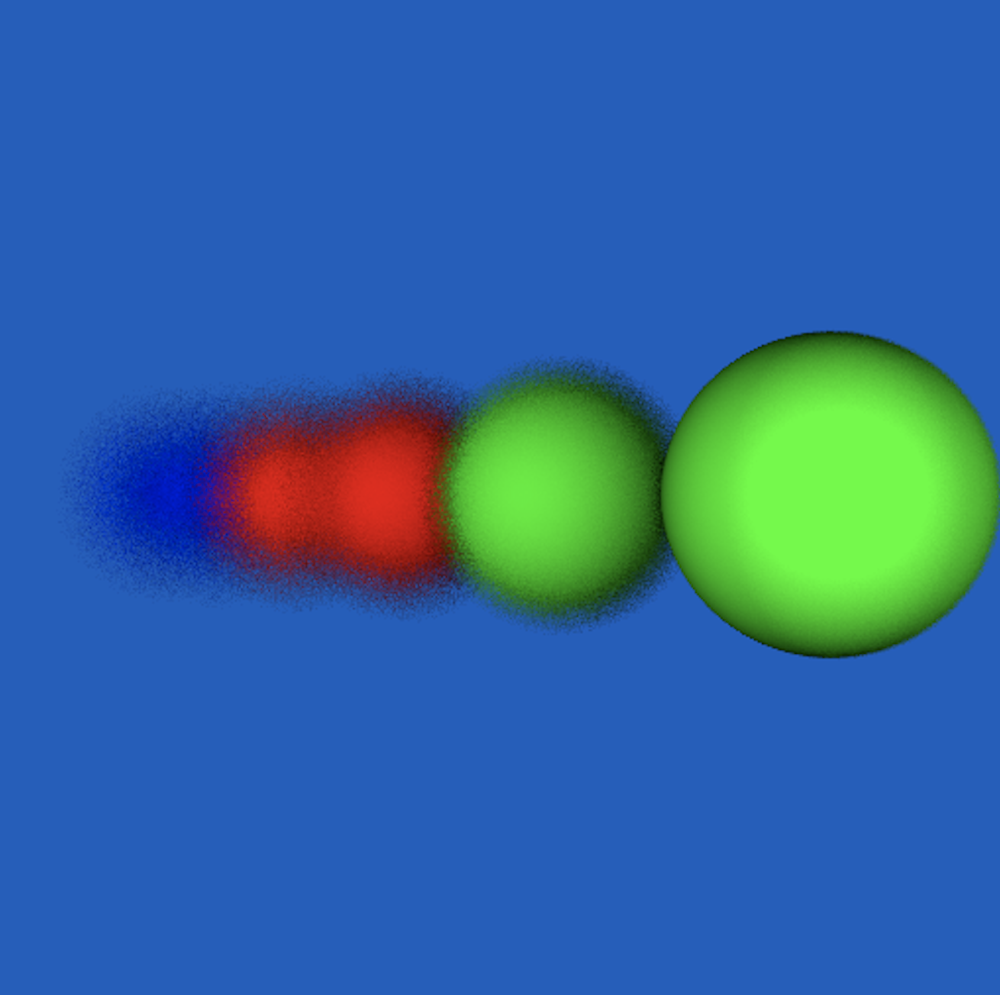

# P3D Modelation

## How to Run

 - make
 - ./main file_name
 
 ## How to change modes

* Draw Mode: 0 - point by point; 1 - line by line; 2 - full frame
- draw_mode;

* Camera Mode: 0 - prespective; 1 - DoP
- camera_mode

* Soft shadows: 0 - off; 1 - softShadows with Jittering Method
- softShadows

* Anti- Alising:  0 - off ; 1 - antiAliasinng with Stochastic Sampling;  2 - antiAliasing with Jittering Method
- antiAliasing

* Acceleration grid: 0 - off; 1 - on;
- acceleration_grid

## What you will expect

* By running our DoF nff and set the fdRatio to 0.2 and aperture to 0.1 you will see:

